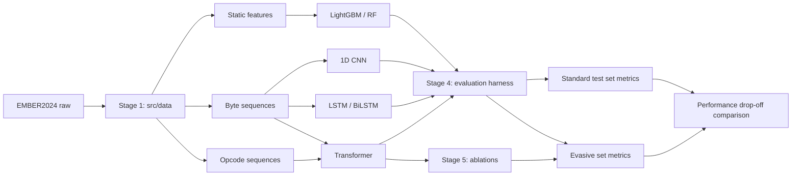

# Step-by-Step Coding Guide: How It Is Coded and Why

This is the running record of how this project is built. Each stage gets a
chapter, filled in **as the stage is implemented**, covering:

- **What** was built, module by module, in the order it was written
- **Why** each design decision was made (the reasoning a paper reviewer or
  presentation audience would ask about)
- **Plain-English intuition** for each component, ready to reuse in the
  paper's methodology section and slides

Rules the code follows are in [CODE_STANDARDS.md](CODE_STANDARDS.md).
The research framing is in [Project_Summary.md](Project_Summary.md).

---

## The big picture (read this first)

The entire codebase exists to produce **one comparison**: how much does each
model's performance *drop* when moving from the standard EMBER2024 test set
to the evasive challenge set?



Every module below serves that diagram. If a piece of code doesn't help
produce or explain the drop-off comparison or the ablations, it doesn't
belong in the project.

### Module map

```
src/
├── data/                  Stage 1 — raw EMBER2024 → model-ready inputs
├── models/
│   ├── base.py            Common fit/predict_proba/save/load interface
│   ├── baselines/         Stage 2 — LightGBM, 1D CNN, LSTM
│   └── transformer/       Stage 3 — tokenizer, positional encoding, encoder
├── evaluation/            Stage 4 — metrics, evasive eval, drift, adversarial
└── ablation/              Stage 5 — config sweeps over the transformer
```

---

## Chapter 1 — Data pipeline (`src/data/`)  [IN PROGRESS]

**Goal:** turn raw EMBER2024 into model-ready inputs, plus clean train / test /
evasive splits.

### Implemented so far

| Module | Job | Why it was built this way |
|--------|-----|---------------------------|
| `download_ember.py` | Fetch EMBER2024 train/test/challenge zips via `thrember` into `data/raw/` | Official HuggingFace distribution; restores `cwd` after thrember's `os.chdir` |
| `static_features.py` | Vectorize JSONL → EMBER feature-v3 vectors (dim 2568), with optional stratified subsample | LightGBM needs static features first; full Win32 does not fit in 16 GB RAM, so we default to **Win64** + capped train/test samples while keeping the **challenge set in full** |
| `imbalance.py` | Inverse-frequency class / sample weights | Makes imbalance handling explicit and reusable by later models |

### Design decisions (paper-relevant)

1. **Win64 instead of Win32 for the first baseline.** Win32 train features alone are ~24 GB; after vectorization they exceed typical 16 GB laptop RAM. Win64 is still Windows PE and preserves the PE research focus. Scaling to full Win32 is a config change, not a code rewrite.
2. **Stratified subsample for train/test, full challenge.** The research question lives on the evasive set (~6.3k). Subsampling the temporal split is an engineering necessity and is recorded in the config / results JSON so the paper can state exact N.
3. **Challenge ROC protocol.** Follow EMBER2024's official eval: mix challenge malware with test benign before ROC/PR (challenge alone is all-malicious, so ROC-AUC is undefined).

### Still planned

| Module | Job | Why it exists |
|--------|-----|---------------|
| `byte_features.py` | Raw byte-sequence n-grams | No-domain-knowledge representation for CNN/LSTM/transformer |
| `opcode_features.py` | Capstone opcode sequences | Closer to behavior under metamorphic rewriting |
| `splits.py` | Explicit temporal / challenge split helpers | Shared by all input representations |

---

## Chapter 2 — Baseline models (`src/models/baselines/`)  [IN PROGRESS]

**Goal:** establish the performance floor the transformer must beat.

### Implemented so far

| Module | Job | Why |
|--------|-----|-----|
| `src/models/base.py` | Shared `fit / predict_proba / save / load` | Fair comparison across models |
| `lightgbm_model.py` | LightGBM on static EMBER vectors | Strongest classical EMBER baseline |
| `byte_features.py` | Histogram → fixed-length byte sequence | EMBER2024 has no raw bytes; expand 256-bin histogram to seq_len |
| `training.py` | Shared PyTorch train loop (BCE, early stop, GPU) | CNN and LSTM get identical training budget |
| `cnn_model.py` | 1D CNN (embedding + Conv1d + max pool) | Tests **local** byte patterns |
| `lstm_model.py` | BiLSTM (embedding + LSTM + max pool) | Tests **sequential** modeling without attention |
| `run_sequence_baseline.py` | End-to-end CNN/LSTM runner | Same eval harness as LightGBM |
| `run_lightgbm_baseline.py` | LightGBM runner | Static-feature baseline |

Configs: `experiments/configs/cnn_win64_baseline.yaml`, `lstm_win64_baseline.yaml` (run on Colab with GPU).

**Byte sequence design decision:** each sample's 256-bin `histogram` field is expanded deterministically to `seq_len` (default 4096) by repeating byte values in proportion to their counts. This is documented in `byte_features.py` — cite the limitation in the paper (not original byte order).

Still planned: `random_forest` (optional). Transformer is Stage 3.

---

## Chapter 3 — Transformer (`src/models/transformer/`)  [NOT YET IMPLEMENTED]

**Goal:** the core contribution — a self-attention encoder over byte/opcode
sequences.

Planned modules:

| Module | Job | Why it exists |
|--------|-----|---------------|
| `tokenizer.py` | Bytes/opcodes → token ids | Vocabulary design is a research variable (byte-level vs opcode-level is an ablation axis) |
| `positional_encoding.py` | Position information for code structure | Code position ≠ text position; the encoding choice is an ablation axis |
| `encoder.py` | Multi-head self-attention encoder stack | The hypothesis: attention captures *long-range* structural patterns that survive metamorphic rewriting |
| `classifier.py` | Pooling + classification head, wrapped in `BaseClassifier` | Keeps the model plug-compatible with the evaluation harness |
| `train.py` | Training loop: class-weighted loss, seeding, checkpointing | All training behavior in one auditable place |

The key sentence for the paper (to be validated or refuted): *metamorphic
malware changes local byte patterns but preserves global program structure;
self-attention can relate distant positions directly, so it should degrade
less on evasive samples than CNNs (local windows) or LSTMs (sequential
bottleneck).*

---

## Chapter 4 — Evaluation harness (`src/evaluation/`)  [NOT YET IMPLEMENTED]

**Goal:** the heart of the research — every model evaluated twice, and the
*drop-off* compared.

Planned modules:

| Module | Job | Why it exists |
|--------|-----|---------------|
| `metrics.py` | Accuracy, precision, recall, F1, ROC-AUC | Standard reporting |
| `evasive_eval.py` | Standard-set vs evasive-set evaluation and drop-off table | The central experiment — the number the whole paper is about |
| `drift_eval.py` | Performance across the temporal split | Tests robustness to malware evolving over time |
| `adversarial.py` | Padding injection, benign section insertion | Tests robustness to cheap evasion tricks |
| `efficiency.py` | Training time, inference latency, params, memory | The efficiency/accuracy trade-off is itself a listed contribution |
| `run_experiment.py` | Loads a config, trains a model, runs all evals, writes `experiments/results/` | One entry point → one results folder → one row in the paper |

---

## Chapter 5 — Ablation studies (`src/ablation/`)  [NOT YET IMPLEMENTED]

**Goal:** answer *why*. Vary one component at a time and re-run the
evasive-set evaluation.

Ablation axes (each is just a config change, per CODE_STANDARDS rule 2):

1. Number of attention heads
2. Encoder depth (number of layers)
3. Input representation: bytes vs opcodes
4. Positional encoding variant

Planned module: `sweep.py` — reads a base config plus a list of overrides,
runs `run_experiment.py` for each, and aggregates results into a single
ablation table for the paper.

---

## Chapter 6 — Write-up (`report/`)  [NOT YET IMPLEMENTED]

**Goal:** results tables, figures, discussion, conclusions.

The methodology section should largely assemble itself from the "why"
docstrings and the chapters above — that is the point of maintaining this
guide as the code is written.
