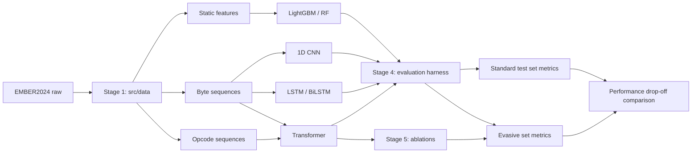

# Step-by-Step Coding Guide: How It Is Coded and Why

This is the running record of how this project is built. Each stage gets a
chapter, filled in **as the stage is implemented**, covering:

- **What** was built, module by module, in the order it was written
- **Why** each design decision was made (the reasoning a paper reviewer or
  presentation audience would ask about)
- **Plain-English intuition** for each component, ready to reuse in the
  paper's methodology section and slides

Rules the code follows are in [CODE_STANDARDS.md](CODE_STANDARDS.md).
The research framing is in [Project_Summary.md](Project_Summary.md).

---

## The big picture (read this first)

The entire codebase exists to produce **one comparison**: how much does each
model's performance *drop* when moving from the standard EMBER2024 test set
to the evasive challenge set?



Every module below serves that diagram. If a piece of code doesn't help
produce or explain the drop-off comparison or the ablations, it doesn't
belong in the project.

### Module map

```
src/
├── data/                  Stage 1 — raw EMBER2024 → model-ready inputs
├── models/
│   ├── base.py            Common fit/predict_proba/save/load interface
│   ├── baselines/         Stage 2 — LightGBM, 1D CNN, LSTM
│   └── transformer/       Stage 3 — tokenizer, positional encoding, encoder
├── evaluation/            Stage 4 — metrics, evasive eval, drift, adversarial
└── ablation/              Stage 5 — config sweeps over the transformer
```

---

## Chapter 1 — Data pipeline (`src/data/`)  [NOT YET IMPLEMENTED]

**Goal:** turn raw EMBER2024 into three parallel representations of each PE
file, plus clean train / test / evasive splits.

Planned modules (to be documented as they are written):

| Module | Job | Why it exists |
|--------|-----|---------------|
| `download.py` | Fetch/verify EMBER2024 archives into `data/raw/` | Reproducibility: anyone can rebuild the dataset from scratch |
| `byte_features.py` | Raw byte-sequence n-grams | The "no domain knowledge" representation — tests whether models learn structure themselves |
| `opcode_features.py` | Disassembled opcode sequences via Capstone | Metamorphic malware rewrites bytes but must preserve *behavior*; opcodes sit closer to behavior than raw bytes |
| `static_features.py` | EMBER's engineered header/import/section features | The classical-ML representation the tree baselines need |
| `splits.py` | Temporal train/test split + evasive challenge subset | The temporal split tests concept drift; the evasive subset is the entire point of the study |
| `imbalance.py` | Stratified sampling / class-weight computation | Malware datasets are imbalanced; without this, accuracy numbers are misleading |

Decisions to record when implementing: sequence truncation length (and what
fraction of files it covers), n-gram size, Capstone architecture mode
(x86/x64 handling), how ties between representations are kept aligned per
sample.

---

## Chapter 2 — Baseline models (`src/models/baselines/`)  [NOT YET IMPLEMENTED]

**Goal:** establish the performance floor the transformer must beat, using
architectures the literature already trusts.

Planned modules:

| Module | Job | Why it exists |
|--------|-----|---------------|
| `../base.py` | `BaseClassifier` interface | One harness, four models — makes the comparison provably fair |
| `lightgbm_model.py` | Gradient-boosted trees on static features | The strongest published classical baseline on EMBER-style features |
| `cnn_model.py` | 1D CNN on byte sequences | Tests whether *local* byte patterns are enough (CNNs see only fixed windows) |
| `lstm_model.py` | LSTM/BiLSTM on byte sequences | Tests *sequential* modeling without attention — the direct foil to the transformer |

The baselines are deliberately standard implementations. Any tuning applied
to the transformer (learning-rate schedule, early stopping budget) is applied
equally here, and that will be documented in this chapter.

---

## Chapter 3 — Transformer (`src/models/transformer/`)  [NOT YET IMPLEMENTED]

**Goal:** the core contribution — a self-attention encoder over byte/opcode
sequences.

Planned modules:

| Module | Job | Why it exists |
|--------|-----|---------------|
| `tokenizer.py` | Bytes/opcodes → token ids | Vocabulary design is a research variable (byte-level vs opcode-level is an ablation axis) |
| `positional_encoding.py` | Position information for code structure | Code position ≠ text position; the encoding choice is an ablation axis |
| `encoder.py` | Multi-head self-attention encoder stack | The hypothesis: attention captures *long-range* structural patterns that survive metamorphic rewriting |
| `classifier.py` | Pooling + classification head, wrapped in `BaseClassifier` | Keeps the model plug-compatible with the evaluation harness |
| `train.py` | Training loop: class-weighted loss, seeding, checkpointing | All training behavior in one auditable place |

The key sentence for the paper (to be validated or refuted): *metamorphic
malware changes local byte patterns but preserves global program structure;
self-attention can relate distant positions directly, so it should degrade
less on evasive samples than CNNs (local windows) or LSTMs (sequential
bottleneck).*

---

## Chapter 4 — Evaluation harness (`src/evaluation/`)  [NOT YET IMPLEMENTED]

**Goal:** the heart of the research — every model evaluated twice, and the
*drop-off* compared.

Planned modules:

| Module | Job | Why it exists |
|--------|-----|---------------|
| `metrics.py` | Accuracy, precision, recall, F1, ROC-AUC | Standard reporting |
| `evasive_eval.py` | Standard-set vs evasive-set evaluation and drop-off table | The central experiment — the number the whole paper is about |
| `drift_eval.py` | Performance across the temporal split | Tests robustness to malware evolving over time |
| `adversarial.py` | Padding injection, benign section insertion | Tests robustness to cheap evasion tricks |
| `efficiency.py` | Training time, inference latency, params, memory | The efficiency/accuracy trade-off is itself a listed contribution |
| `run_experiment.py` | Loads a config, trains a model, runs all evals, writes `experiments/results/` | One entry point → one results folder → one row in the paper |

---

## Chapter 5 — Ablation studies (`src/ablation/`)  [NOT YET IMPLEMENTED]

**Goal:** answer *why*. Vary one component at a time and re-run the
evasive-set evaluation.

Ablation axes (each is just a config change, per CODE_STANDARDS rule 2):

1. Number of attention heads
2. Encoder depth (number of layers)
3. Input representation: bytes vs opcodes
4. Positional encoding variant

Planned module: `sweep.py` — reads a base config plus a list of overrides,
runs `run_experiment.py` for each, and aggregates results into a single
ablation table for the paper.

---

## Chapter 6 — Write-up (`report/`)  [NOT YET IMPLEMENTED]

**Goal:** results tables, figures, discussion, conclusions.

The methodology section should largely assemble itself from the "why"
docstrings and the chapters above — that is the point of maintaining this
guide as the code is written.
